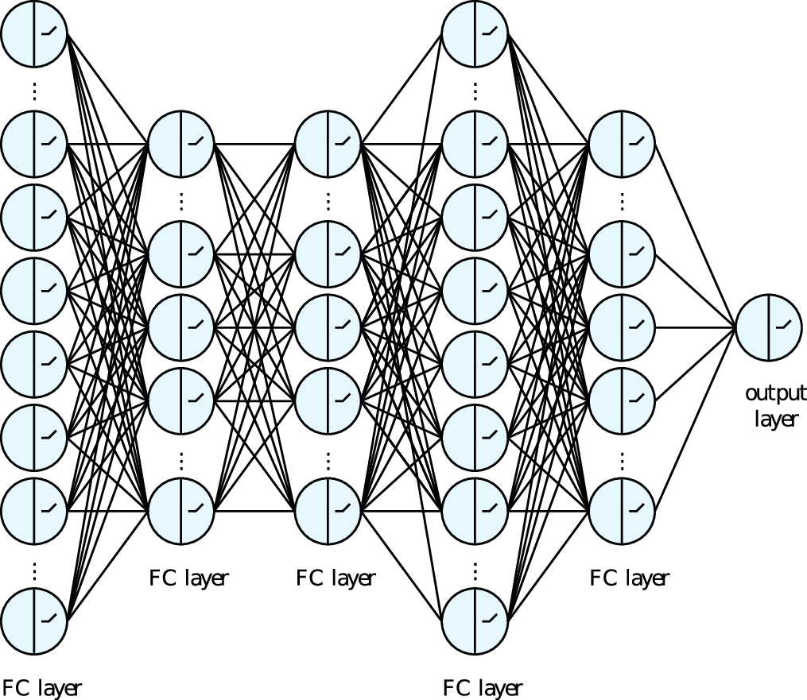
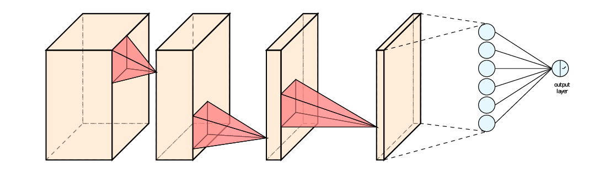
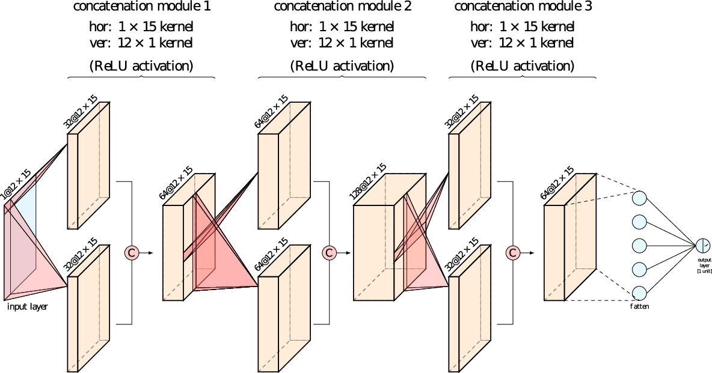

```{r setup, include=FALSE}
knitr::opts_chunk$set(echo = FALSE, message = FALSE, warning = FALSE)
```

<script src="https://ajax.googleapis.com/ajax/libs/jquery/3.5.1/jquery.min.js"></script>
<script>
  $(document).ready(function() {
    $('slide:not(.title-slide, .backdrop, .segue)').append('<footer label=\"Riccardo Finotello - Inception NN for CICY - 21/12/2020 - XVI Avogadro Meeting\"></footer>');
    })
</script>

<style>
  footer:after {
    content: attr(label);
    font-size: 12pt;
    position: absolute;
    bottom: 20px;
    left: 100px;
    line-height: 1.9;
  }
</style>


## String Theory Compactification {.build}

**Superstrings** defined in $D = 10 \quad \Rightarrow \quad \mathcal{M}^{1, 9} = \mathcal{M}^{1, 3} \otimes X_6$

<div class="columns-2">
<div class="fcenter">
### Requirements
- $X_6$ is a compact manifold $(M, g)$
- $N = 1$ **SUSY** in 4D
- **SM** $\subset$ arising gauge algebra
</div>
<div class="fcenter">
### Solution
- $\dim_{\mathbb{C}} M = m$
- $\mathrm{Hol}(g) \subseteq \mathrm{SU}(m)$
- $\mathrm{Ric}(g) \equiv 0$ or $c_1(M) \equiv 0$
</div>
</div>

<div class="fbox centered">
### **Calabi-Yau Manifolds**
</div>

<div class="centered">
- no known **metric** for compact CY
- need to study **topology** (*Hodge numbers*) to infer **4D properties**

<div class="red2">
$$h^{r,s} = \dim_{\mathbb{C}} \mathrm{H}_{\overline{\partial}}^{r,s}(M, \mathbb{C})$$
</div>
</div>


## Complete Intersection Calabi-Yau Manifolds {.build}

Systems of **$k$ homogeneous equations** from products of **$m$ projective spaces**

<div class="red2">
$$
X =
\begin{bmatrix}
  \mathbb{P}^{n_1} &  |  & a^1_1  & \cdots & a^1_k
  \\
  \vdots           &     & \vdots & \ddots & \vdots
  \\
  \mathbb{P}^{n_m} &  |  & a^m_1  & \cdots & a^m_k
\end{bmatrix}
$$
</div>

such that

$$
a^r_{\alpha} \in \mathbb{N},
\quad
\dim_{\mathbb{C}} X = \sum\limits_{r = 1}^m n_r - k = 3,
\quad
n_r + 1 = \sum\limits_{\alpha = 1}^k a^r_{\alpha}
$$

where $a^r_{\alpha}$ are **powers** of coordinates on $\mathbb{P}^{n_r}$ in equation $\alpha$.


## Available Data

$\exists$ compiled datasets of **7890** CICY 3-folds with all **Hodge numbers** <span class="green2">[Candelas et al. (1988)]</span>

<div class="centered">
```{r data, cache=TRUE, out.width="90%"}
# location of the file
file.url <- "http://www.lpthe.jussieu.fr/~erbin/files/data/cicy3o_data.tar.gz"
file.dir <- file.path(".", "data")
file.out <- file.path(file.dir, "cicy3o_data.tar.gz")

# download the file
dir.create(file.dir, showWarnings = FALSE)
if (!file.exists(file.out)) {download.file(file.url, file.out)}

# extract the file
library(rhdf5)
data.name <- "cicy3o.h5"
data.loc  <- file.path(file.dir, data.name)
data.lab  <- h5read(data.loc, "/orig_cydata/block1_values")
data.mat  <- h5read(data.loc, "/orig_cydata/block4_values")

# create table
library(data.table)
DT <- data.table(h11=data.lab[2,], h21=data.lab[3,])

# produce plots
library(plotly)
h11 <- plot_ly(DT,
               x=~h11,
               type="histogram",
               alpha=0.35,
               name="h<sup>1,1</sup>",
               marker=list(line=list(color="darkgray", width=2)),
               hovertemplate="h<sup>1,1</sup> = %{x:d}<br>count = %{y:d}",
               showlegend = FALSE
               )

h21 <- plot_ly(DT,
               x=~h21,
               type="histogram",
               alpha=0.35,
               name="h<sup>2,1</sup>",
               marker=list(line=list(color="darkgray", width=2)),
               hovertemplate="h<sup>2,1</sup> = %{x:d}<br>count = %{y:d}",
               showlegend = FALSE
               )

hodge <- subplot(layout(h11,
                        yaxis=list(type="log", ticks="outside", tickvals=c(1, 10, 100, 1000)),
                        xaxis=list(title="h<sup>1,1</sup>", tickvals=c(0, 5, 10, 15, 20)),
                        plot_bgcolor="rgba(0, 0, 0, 0)",
                        paper_bgcolor="rgba(0, 0, 0, 0)"
                        ),
                 layout(h21,
                        yaxis=list(type="log", ticks="outside", tickvals=c(1, 10, 100, 1000)),
                        xaxis=list(title="h<sup>2,1</sup>", tickvals=c(0, 25, 50, 75, 100)),
                        plot_bgcolor="rgba(0, 0, 0, 0)",
                        paper_bgcolor="rgba(0, 0, 0, 0)"
                        ),
                 shareY=TRUE,
                 titleX=TRUE,
                 heights=0.75,
                 widths=c(0.5, 0.5)
                ) %>% config(displayModeBar=FALSE)
hodge <- layout(hodge, title="Distribution of the Hodge Numbers")
hodge
```
</div>


## Supervision and Function Approximation {.build}

<div class="centered">
configuration matrix
$\quad \longrightarrow \quad$
$\mathcal{R}\colon \quad \mathbb{N}^{m \times k} \longrightarrow \mathbb{N}$
$\quad \longrightarrow \quad$
Hodge numbers
</div>

<div class="columns-2 vcenter">
<div class="fcenter">
<div class="fbox centered">
### SUPERVISED LEARNING
</div>

- replace $R( X )$ with $R_n( X;\, W )$
- get $W$ such that $\exists n > M > 0$ such that
<span class="red2">
$$
\mathcal{L}(R(X),\, R_n( X;\, W )) < \epsilon, \quad \forall \epsilon > 0
$$
</span>
- follow **gradient descent** $\rightarrow$ find optimal $W$
</div>
<div class="fcenter centered">
{width=75%}]
</div>
</div>


## Neural Networks as Function Approximators {.build}

<div class="fbox centered">
### FULLY CONNECTED NETWORKS
</div>

<div class="columns-2">
<div class="fcenter centered">
{width=75%}
</div>
<div class="fcenter">
- older in design <span class="green2">[Rosenblatt (1958)]</span>
- rose to fame **in the 80s** (first self driving cars, OCR, competitions, etc.)
- simple **matrix multiplications** $+$ **non linearity**
<div class="red2">
$$
a^{\{l+1\}} = \phi\left( w^{\{l\}} a^{\{l\}} + b^{\{l\}} \mathbb{I} \right)
$$
$$
\phi(z) = \mathrm{ReLU}(z) = \max(0, z)
$$
</div>


- **backpropagation** $\rightarrow$ $W^{\{l\}} = \left( w^{\{l\}}, b^{\{l\}} \right)$

</div>

## Neural Networks as Function Approximators {.build}

<div class="fbox centered">
### CONVOLUTIONAL NEURAL NETWORKS
</div>

<div class="centered">
{width=65%}
</div>

<div class="columns-2">
<div class="left">
- newer in conception <span class="green2">[LeCun et al. (1989)]</span>
- based on **sliding windows** (aka *convolutions*)
<span class="red2">
$$
a^{\{l+1\}} = \phi\left( w^{\{l\}} * a^{\{l\}} + b^{\{l\}} \mathbb{I} \right)
$$
</span>
- **less parameters** to *isolate features*
</div>

<div class="fcenter centered">
{width=60%}
</div>

</div>


## Inception Neural Networks {.build}

<div class="centered">
{width=65%}
</div>

<div class="columns-2">
<div class="fcenter">
- inspired by **Google** <span class="green2">[Szegedy et al. (2014)]</span>
- created for **computer vision**
- $2 \times 10^5$ parameters (vs $\ge 2 \times 10^6$)
</div>

<div class="fcenter">
- **concurrent kernels** $\Rightarrow$ shared parameters
- retains **"spatial awareness"**
- improved **generalisation ability**
</div>
</div>


## Results

```{r results, cache=TRUE, out.width="85%"}
# create data
library(data.table)
RES <- data.table(accuracy=c(0.77, 0.68, 0.95, 0.83, 0.99, 0.97, 0.36, 0.23, 0.50, 0.33),
                  hodge=factor(c("h<sup>1,1</sup>", "h<sup>1,1</sup>", "h<sup>1,1</sup>", "h<sup>1,1</sup>", "h<sup>1,1</sup>", "h<sup>1,1</sup>", "h<sup>2,1</sup>", "h<sup>2,1</sup>", "h<sup>2,1</sup>", "h<sup>2,1</sup>")),
                  type=factor(c("FC (previous best)", "FC (previous best)", "ConvNet", "ConvNet", "Inception", "Inception", "ConvNet", "ConvNet", "Inception", "Inception")),
                  ratio=factor(c("80% ratio", "30% ratio", "80% ratio", "30% ratio", "80% ratio", "30% ratio", "80% ratio", "30% ratio", "80% ratio", "30% ratio"))
                 )

p <- plot_ly(RES,
             x=~type,
             y=~accuracy,
             type="bar",
             color=~hodge,
             colors="Set1",
             frame=~ratio,
             alpha=0.5,
             text=paste(100 * RES$accuracy, "%"),
             textposition="outside",
             cliponaxis=FALSE,
             hovertemplate="%{x}: accuracy = %{text}",
             textfont=list(color="black"),
             showlegend=TRUE
            ) %>%
     animation_opts(500, easing="linear", redraw=FALSE) %>%
     animation_button(hide=TRUE) %>%
     animation_slider(currentvalue=list(prefix="")) %>%
     layout(title="Accuracy of Inception Architecture",
            xaxis=list(title="",
                       categoryorder="array",
                       categoryarray=RES$type
                      ),
            plot_bgcolor="rgba(0, 0, 0, 0)",
            paper_bgcolor="rgba(0, 0, 0, 0)"
            ) %>%
     config(displayModeBar=FALSE)
p
```

<div class="fright green2">[Erbin, RF (2020)]</div>


## Comparison

```{r comparison, cache=TRUE, out.width="85%"}
# create data
CFR <- data.table(implementations=factor(c("lin. reg. (80%)",
                                           "SVM RBF (reg., 30%)",
                                           "SVM RBF (reg., 80%)",
                                           "He [2017] (reg., 63%)",
                                           "Bull et al. [2018] (reg., 70%)",
                                           "Bull et al. [2018] (class, 70%)",
                                           "Inception (reg., 30%)",
                                           "Inception (reg., 80%)"
                                          )
                                         ),
                  accuracy=c(0.45, 0.55, 0.68, 0.37, 0.75, 0.85, 0.97, 0.99)
                 )

q <- plot_ly(CFR,
             x=~implementations,
             y=~accuracy,
             type="bar",
             colors="Set1",
             alpha=0.5,
             text=paste(100 * CFR$accuracy, "%"),
             textposition="outside",
             cliponaxis=FALSE,
             hovertemplate="%{x}: accuracy = %{text}",
             textfont=list(color="black"),
             name="h<sup>1,1</sup>",
             showlegend=TRUE
            ) %>%
     layout(title="Comparison of Accuracy for h<sup>1,1</sup>",
            xaxis=list(title="",
                       categoryorder="array",
                       categoryarray=CFR$implementations
                      ),
            margin=unit(c(0,0,0,0), "cm"),
            plot_bgcolor="rgba(0, 0, 0, 0)",
            paper_bgcolor="rgba(0, 0, 0, 0)"
            ) %>%
     config(displayModeBar=FALSE)
q
```

<div class="fright green2">[Erbin, RF (2020)]</div>


## Conclusion {.build}

<div class="centered fbox">
[Machine learning is] <br> *the field of study that gives computers the ability to learn without being explicitly programmed*.

A. Samuel (1959)
</div>

- **deep learning** can be a **reliable predictive method**
- it can be used as **source of inspiration** for **inference and generalisation**
- **CNN**s have a lot of **unexpressed potential** in physics (*first time?*)
- the approach intersects **mathematics**, **physics** and **computer science**

### What Lies Ahead?

<div class="columns-2">
<div class="fcenter">
- improve $h^{2,1}$ for CICY 3-folds
- more exploration for CICY 4-folds
- study **symmetries** (GNNs, Transformers, etc.)
</div>

<div class="fcenter">
- "un-blackbox" the model (SHAP, filter analysis, etc.)
- **representation learning** (DGAN, VAE, etc.)
- exploration of the **string landscape**
</div>
</div>

